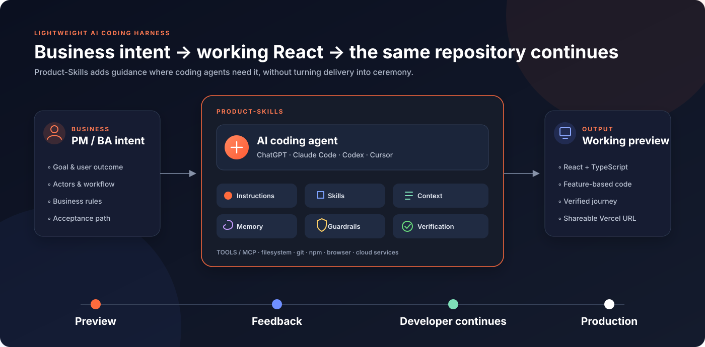
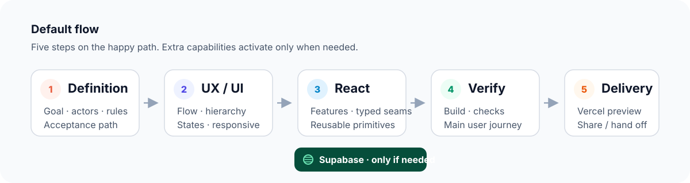
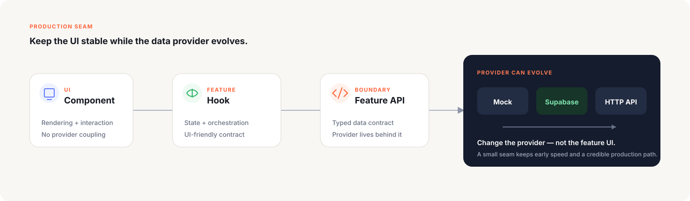
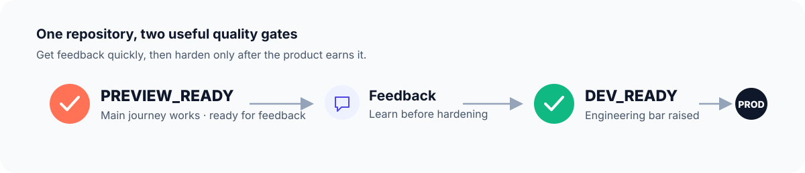

# Product-Skills

> **Product-Skills is a lightweight AI coding harness for Product Managers and Business Analysts to turn business ideas into deployable React POCs while preserving a codebase developers can continue toward production.**

Product-Skills adds just enough **product definition, UX/UI guidance, engineering conventions, context discipline, and verification** around AI coding agents such as **ChatGPT, Claude Code, Codex, and Cursor**.

The goal is simple: **describe a business workflow, get a credible React experience online quickly, then keep building from the same repository.**

  

## 🎯 What it solves

| | Without guidance | With Product-Skills |
|---|---|---|
| 🧭 **Product intent** | Agent guesses missing behavior | Goal, actors, rules, and acceptance path stay visible |
| 🎨 **UX/UI** | Generic screens and missing states | Flow, hierarchy, responsive states, and accessibility basics |
| 🧱 **Code quality** | Fast demo code becomes rewrite debt | Feature boundaries and replaceable data providers |
| ✅ **Confidence** | “Build passed” is treated as done | Main user journey is actually verified |
| ⚡ **Speed** | Too much ceremony or too much improvisation | Short happy path; extra machinery only when useful |

## ⚡ Default flow

For a new interface, the agent should normally follow one short path:

  

**Supabase is conditional.** Add it only when the experience needs persistence, authentication, storage, or realistic shared data.

Repository exploration, deeper review, debugging, and hardening are also conditional. The harness should be mostly invisible when the task is straightforward.

## 🧩 Six core skills

| Skill | Purpose | Load when |
|---|---|---|
| 🧭 [`definition`](./skills/definition/) | Goal, actors, journey, business rules, screens, acceptance criteria | New or ambiguous work |
| 🎨 [`ux-ui`](./skills/ux-ui/) | User flow, hierarchy, states, responsive and accessibility direction | UI work |
| ⚛️ [`react`](./skills/react/) | Maintainable React implementation and feature boundaries | React implementation |
| 🗄️ [`supabase`](./skills/supabase/) | Reproducible data/auth/storage with safe client boundaries | Data is required |
| ✅ [`verify`](./skills/verify/) | Deterministic checks plus the primary user journey | Before sharing |
| 🚀 [`delivery`](./skills/delivery/) | Vercel preview, environment checks, developer-ready hardening | Share or hand off |

Skills are deliberately broad. **Split by independent reuse, not conceptual purity.**

## 🧱 Code developers can continue

For greenfield work, prefer a small feature-based React structure rather than a throw-away demo architecture.

| Area | Responsibility |
|---|---|
| `src/app/` | App shell, routing, providers |
| `src/components/ui/` | Shared UI primitives |
| `src/features/<feature>/` | Feature UI, hooks, schemas, types, and data access |
| `src/config/` | Environment and application configuration |
| `src/lib/` | Shared infrastructure helpers |
| `src/testing/` | Test utilities and fixtures |

Create only the folders a feature actually needs.

The most important production seam is the data boundary:

  

A feature can start with mock data, move to Supabase, and later use a dedicated backend without forcing the UI to be rewritten.

## 🎨 UX/UI baseline

The UX/UI capability is practical, not ceremonial. Before implementation, make the **primary journey** clear and identify the states that matter: loading, empty, validation, error, success, permissions, and confirmation where relevant.

For a greenfield business interface, prefer mature primitives and a restrained visual system:

**React · TypeScript · Vite · Tailwind CSS · shadcn/ui**

Use the existing stack and design language when working inside an established repository.

Responsive smoke targets: **375 · 768 · 1024 · 1440**, with visible focus, understandable validation, readable contrast, and usable primary actions at each breakpoint.

## 🧠 How the harness stays fast

The harness is the behavior created by the repository as a whole — **instructions, skills, context, memory, tools, guardrails, verification, and conditional subagents**. It is not a `harness/` directory.

### Small context

A normal implementation task should receive only what it needs: `AGENTS.md`, current product/UI notes, verified project facts, one relevant skill, and the relevant feature files.

Do not load every skill, the entire repository, or the whole conversation by default.

### Small memory

| File | Stores |
|---|---|
| `memory/PROJECT.md` | Verified project facts and conventions |
| `memory/DECISIONS.md` | Durable technical/product decisions |
| `memory/LESSONS.md` | Verified mistakes worth preventing again |

Memory is not a transcript archive.

### Conditional subagents

- 🔎 **explorer** — unfamiliar repository or pattern search
- 👀 **reviewer** — large, risky, or cross-feature change
- ✅ **verifier** — independent evidence for the main acceptance journey
- 🛠️ **debugger** — observed failure with an unclear root cause

Small greenfield work should not become a multi-agent ceremony.

### One execution loop

Implementation has one simple control rule: **implement → verify → continue when it passes; diagnose, fix, and verify again when it fails.** No failure means no debugging loop.

## ✅ Quality path

The same repository moves forward instead of being replaced after the first stakeholder review.

  

### `PREVIEW_READY`

Ready for stakeholder feedback when the primary journey works, the interface is understandable on desktop and mobile, there is no obvious runtime failure, the preview is reachable, and the acceptance path has been exercised.

### `DEV_READY`

The same repository reaches a higher engineering bar: clean feature boundaries, build/type/lint checks, tests for important behavior, reproducible migrations when data is used, accurate environment setup, and visible known debt.

This separation keeps early feedback fast without hiding the work needed for production.

## 🚀 Try it

Give the coding agent a **business request**, not an implementation blueprint:

> Build a purchase-request interface. Employees create and submit requests. Managers review, approve, or reject them. Start with the shortest credible workflow, use mock data unless persistence is necessary, and deploy a shareable preview to Vercel.

The agent should resolve only ambiguity that materially changes behavior, then move to implementation quickly.

## 🤖 Supported coding agents

| Runtime | Project integration |
|---|---|
| **ChatGPT** | Repository context + `AGENTS.md` + canonical skills |
| **Claude Code** | Thin `CLAUDE.md`; runtime configuration under `.claude/` |
| **OpenAI Codex** | `AGENTS.md`; runtime configuration under `.codex/` |
| **Cursor** | Runtime rules/config under `.cursor/`; canonical skills stay at `/skills` |

See [`docs/RUNTIME-COMPATIBILITY.md`](./docs/RUNTIME-COMPATIBILITY.md).

## 🗂 Repository map

| Path | Role |
|---|---|
| `README.md` | Human entry point |
| `AGENTS.md` | Shared coding-agent map and invariants |
| `skills/` | Canonical reusable capabilities |
| `workflows/` | Short execution recipes |
| `subagents/` | Optional isolated role contracts |
| `memory/` | Small durable project context |
| `rules/` | Engineering, security, delivery invariants |
| `hooks/` | Deterministic safety and ship checks |
| `scripts/` | Validation and setup utilities |
| `templates/` | React starter contract |
| `.claude/`, `.codex/`, `.cursor/` | Runtime-specific configuration only |
| `docs/` | Deeper architecture and runtime documentation |

`skills/` is the canonical skill source. Runtime-specific directories must not become duplicated skill libraries.

## 📚 Deeper docs

- [`docs/HARNESS-ENGINEERING.md`](./docs/HARNESS-ENGINEERING.md) — model vs harness, context, memory, subagents, verification
- [`docs/RUNTIME-COMPATIBILITY.md`](./docs/RUNTIME-COMPATIBILITY.md) — runtime-specific discovery and configuration

## Principles

- **Speed is a feature.** Harness mechanisms must earn their latency.
- **Verified evidence beats agent confidence.**
- **Keep context small.** More context is not automatically better context.
- **Do not abstract before the problem requires it.**
- **The same repository should have a credible path from first preview to production.**

## License

MIT
