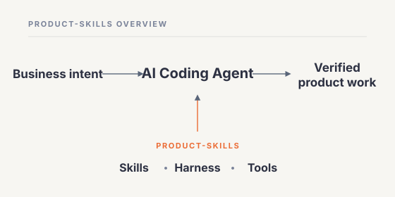
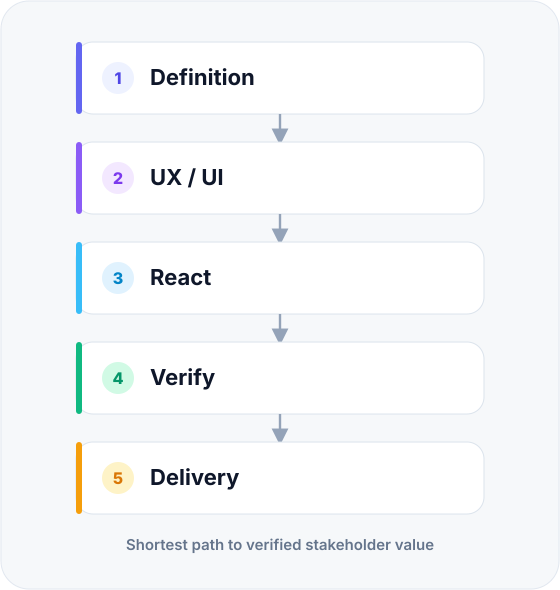
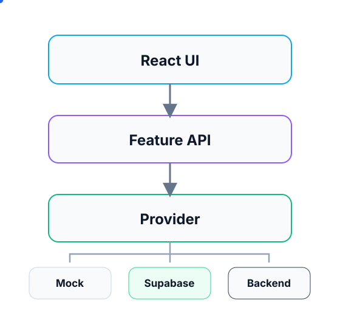

# Product-Skills

> **Product-Skills is a lightweight AI coding harness for Product Managers and Business Analysts to turn business ideas into deployable React experiences while preserving a codebase developers can continue toward production.**

Product-Skills adds just enough **product definition, UX/UI guidance, engineering conventions, context discipline, tools, and verification** around an AI coding agent.

It is **runtime-agnostic**. Any capable coding agent can use the repository conventions. Claude Code, OpenAI Codex, and Cursor currently have project configuration committed in this repo; ChatGPT can use repository context and connected tools. More runtimes can be added without changing the canonical skills.

The goal is simple: **describe a business workflow, get a credible React experience online quickly, then keep building from the same repository.**

## 🧭 System overview

  

The diagram intentionally shows only the architecture flow. Details stay in text so the visual remains readable on desktop and mobile.

- **PM / BA** provides business intent.
- **Product-Skills** guides the coding agent with skills, context, memory, guardrails, tools, and verification.
- **React + TypeScript + Vite** is the default greenfield frontend target.
- **Vercel** provides the shareable preview and deployment feedback loop.
- **Supabase is optional** and only enters when a real backend improves the experience.

## 🎯 What it solves

### 🧭 Keep product intent visible
Goal, actors, business rules, and the acceptance path stay explicit so the agent does not silently invent important behavior.

### 🎨 Improve UX/UI output
The agent reasons about the main user journey, important states, responsive behavior, and accessibility basics instead of producing generic screens.

### 🧱 Preserve a production path
Generated React stays feature-oriented, typed, and separated from its data provider so developers can continue the same repository.

### ✅ Verify before sharing
A successful build is not treated as proof. The main user journey must actually work in the running application.

### ⚡ Stay fast
Extra review, subagents, backend infrastructure, and hardening are conditional. Straightforward work should remain straightforward.

## ⚡ Default flow

  

**Definition → UX/UI → React → Verify → Delivery** is the happy path.

Use **Supabase only when a real backend materially improves the experience** — for persistence, authentication, storage, shared data, or server-side behavior. Repository exploration, deeper review, debugging, and hardening are also activated only when they reduce real risk.

## 🧩 Six core skills

### 🧭 [`definition`](./skills/definition/)
Turns business intent into the minimum buildable definition: goal, actors, journey, rules, screens, and acceptance criteria.

### 🎨 [`ux-ui`](./skills/ux-ui/)
Defines flow, hierarchy, states, responsive behavior, and practical accessibility direction.

### ⚛️ [`react`](./skills/react/)
Builds maintainable React with TypeScript, lint-clean code, simple feature boundaries, and reusable UI primitives.

### 🗄️ [`supabase`](./skills/supabase/)
Optional backend accelerator. The agent can use Supabase tools to create data/auth/storage/server-side behavior while keeping SQL, migrations, policies, and API/data contracts reusable by developers later.

### ✅ [`verify`](./skills/verify/)
Runs deterministic checks and proves the primary user journey in the running application.

### 🚀 [`delivery`](./skills/delivery/)
Publishes a verified preview to Vercel and later raises the same repository to developer-ready quality.

Skills are intentionally broad: **split by independent reuse, not conceptual purity.**

## 🧹 Engineering baseline

For a **greenfield React project**, Product-Skills requires a small but real quality baseline:

- **TypeScript is mandatory**; use strict mode unless an existing repository has a deliberate different policy.
- **ESLint is mandatory**; lint must pass before `PREVIEW_READY` and `DEV_READY`.
- Do not silence lint/type errors with blanket disables, `any`, or unsafe casts just to make checks pass.
- Keep components and feature boundaries understandable; avoid giant page components and premature abstraction.
- The generated project must expose deterministic scripts for at least **typecheck**, **lint**, and **build**.
- Tests are proportionate to risk; important business behavior should become testable as the product hardens.

For an **existing repository**, preserve its established TypeScript/lint conventions unless there is a concrete reason to change them.

## 🔌 Tools & MCP

**Rule: local deterministic tools first; MCP for remote state and remote actions.**

- 📁 **Filesystem / shell** — native coding-agent tools
- 🌿 **Git** — local diff, status, commit, history
- 📦 **Package manager** — respect the existing project; for greenfield prefer `pnpm`, while `npm` and `yarn` remain supported
- 🧪 **Project checks** — typecheck, lint, test, build using the detected package manager
- 🌐 **Browser verification** — Playwright CLI when available
- 🗃️ **Supabase CLI** — reproducible migrations and local/backend workflows
- 🐙 **GitHub MCP** — repository, PR, issue, and remote state
- ▲ **Vercel MCP** — projects, deployments, preview state, and logs
- 🟢 **Supabase MCP** — optional backend context/actions; keep durable backend artifacts in source control

Project-scoped MCP configuration is committed for runtimes that support repository-local MCP config:

- **Claude Code:** [`.mcp.json`](./.mcp.json)
- **OpenAI Codex:** [`.codex/config.toml`](./.codex/config.toml)
- **Cursor:** [`.cursor/mcp.json`](./.cursor/mcp.json)

Other coding agents can use the same canonical skills and rules through their own tool/config mechanism. Runtime support is additive, not exclusive.

Authentication uses OAuth where supported. **Tokens and privileged credentials must never be committed.**

See [`docs/TOOLS-AND-MCP.md`](./docs/TOOLS-AND-MCP.md).

## 🧱 Code developers can continue

  

The important frontend seam is **Component → Feature Hook → Feature API → Provider**. The provider may start as mock data, use Supabase, or later move behind a dedicated backend without rewriting the UI.

For greenfield interfaces, use a small feature-based React structure:

- `src/app/` — app shell, routing, providers
- `src/components/ui/` — shared UI primitives
- `src/features/<feature>/` — feature UI, hooks, schemas, types, and data access
- `src/config/` — environment/application configuration
- `src/lib/` — shared infrastructure helpers
- `src/testing/` — test utilities and fixtures

Create only the folders a feature actually needs.

When Supabase is used, the repository must preserve the pieces developers can own and evolve:

- migrations / SQL
- RLS policies and auth assumptions
- seed/demo data where useful
- generated or handwritten types
- feature API contracts
- server-side functions/logic when used
- environment requirements

This lets a developer team keep Supabase, harden it, or migrate backend infrastructure while retaining the frontend and business/data contracts.

## 📦 Package manager policy

Product-Skills does not lock generated projects to one package manager.

1. **Existing repository:** use the package manager already selected by lockfile or `packageManager` metadata.
2. **Greenfield:** prefer **pnpm**.
3. **Compatibility:** npm and yarn remain valid; scripts and harness checks must not hard-code one manager.

Typical lockfile detection:

- `pnpm-lock.yaml` → pnpm
- `yarn.lock` → yarn
- `package-lock.json` / `npm-shrinkwrap.json` → npm

## 🎨 UX/UI baseline

Before implementation, make the **primary journey** clear and identify the states that materially affect it: loading, empty, validation, error, success, permissions, and confirmation when needed.

For a greenfield business interface, the default visual stack is:

**React · TypeScript · Vite · Tailwind CSS · shadcn/ui**

Use the existing stack and design language when working inside an established repository.

Responsive smoke targets: **375 · 768 · 1024 · 1440**.

## 🧠 How the harness stays fast

The harness is the repository behavior as a whole — **instructions, skills, context, memory, tools, guardrails, verification, and conditional subagents**. It is not a `harness/` directory.

### Small context
A normal task gets only what it needs: `AGENTS.md`, current product/UI notes, verified project facts, the relevant skill, and relevant feature files.

### Small memory
- `memory/PROJECT.md` — verified project facts and conventions
- `memory/DECISIONS.md` — durable technical/product decisions
- `memory/LESSONS.md` — verified mistakes worth preventing again

Memory is not a transcript archive.

### Conditional subagents
- 🔎 **explorer** — unfamiliar repository or pattern search
- 👀 **reviewer** — large, risky, or cross-feature change
- ✅ **verifier** — independent proof of the main acceptance journey
- 🛠️ **debugger** — observed failure with an unclear root cause

Small greenfield work should not become a multi-agent ceremony.

### One execution loop
**Implement → verify → continue when it passes; diagnose, fix, and verify again when it fails.**

## ✅ Quality path

### `PREVIEW_READY`
Ready for stakeholder feedback when the primary journey works, TypeScript/typecheck and lint/build checks pass, the interface is usable on desktop/mobile, the preview is reachable, and the acceptance path has been exercised.

### `DEV_READY`
The same repository reaches a higher engineering bar: clean feature boundaries, strict TypeScript/lint discipline, proportionate tests, reproducible backend/data setup, accurate environment documentation, and visible known debt.

### Production
The frontend, SQL/migrations, API/data contracts, and server-side logic created during the fast delivery phase become developer-owned assets. Infrastructure can evolve without discarding the useful work.

## 🚀 Try it

Give a coding agent a **business request**, not an implementation blueprint:

> Build a purchase-request interface. Employees create and submit requests. Managers review, approve, or reject them. Start with the shortest credible workflow. Use a backend only if it improves the experience, then deploy a shareable preview to Vercel.

The agent should resolve only ambiguity that materially changes behavior, then move to implementation quickly.

## 🤖 Coding-agent compatibility

Product-Skills is not limited to named vendors. A runtime can use it when it can read repository instructions/skills, edit files, run project commands, and access the tools required for the task.

**Preconfigured today:** Claude Code, OpenAI Codex, Cursor.  
**Also usable:** ChatGPT with repository context/connectors, and other compatible coding agents through their native project/tool configuration.

See [`docs/RUNTIME-COMPATIBILITY.md`](./docs/RUNTIME-COMPATIBILITY.md).

## 🗂 Repository map

- `README.md` — human entry point
- `AGENTS.md` — shared coding-agent map and invariants
- `skills/` — canonical reusable capabilities
- `workflows/` — short execution recipes
- `subagents/` — optional isolated role contracts
- `memory/` — small durable project context
- `rules/` — engineering, security, and delivery invariants
- `hooks/` — deterministic safety and ship checks
- `scripts/` — validation/setup utilities
- `templates/` — React starter contract
- `.mcp.json` — Claude Code project MCP servers
- `.codex/config.toml` — Codex MCP/project configuration
- `.cursor/mcp.json` — Cursor MCP configuration
- `docs/` — deeper architecture, runtime, and tool documentation

`skills/` is the canonical skill source. Runtime-specific configuration must not become duplicated skill libraries.

## 📚 Deeper docs

- [`docs/HARNESS-ENGINEERING.md`](./docs/HARNESS-ENGINEERING.md) — model vs harness, context, memory, subagents, verification
- [`docs/TOOLS-AND-MCP.md`](./docs/TOOLS-AND-MCP.md) — GitHub/Vercel/Supabase MCP, OAuth, approvals, local-tool policy
- [`docs/RUNTIME-COMPATIBILITY.md`](./docs/RUNTIME-COMPATIBILITY.md) — runtime compatibility and current preconfigured runtime integration

## Principles

- **Speed is a feature.** Harness mechanisms must earn their latency.
- **Runtime-agnostic core, runtime-specific configuration.**
- **TypeScript + ESLint are the greenfield code-quality baseline.**
- **Respect the project's package manager; prefer pnpm for greenfield.**
- **Local tools first; MCP for remote state/actions.**
- **Backend tooling must leave reusable artifacts in source control.**
- **Verified evidence beats agent confidence.**
- **Keep context small.** More context is not automatically better context.
- **Do not abstract before the problem requires it.**
- **The same repository should have a credible path from first preview to production.**

## License

MIT
